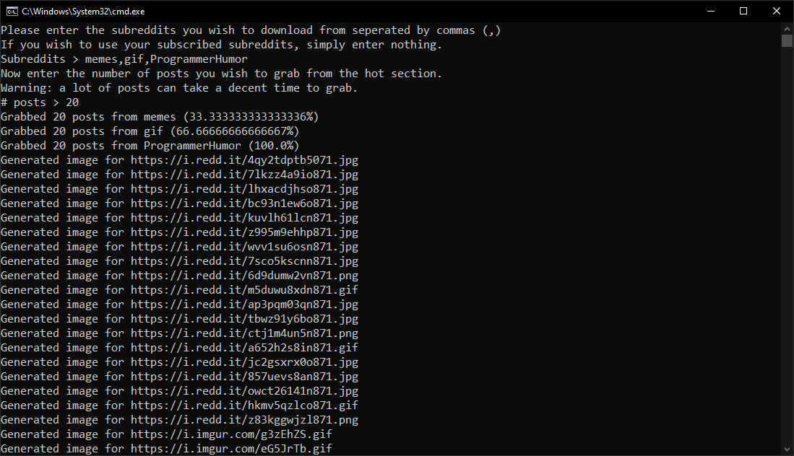
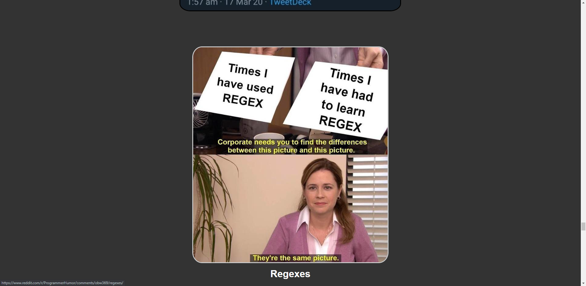

# RedditPictureGrabber
Grabs images and gifs from specified subreddits and adds them to a nicely formatted HTML page. Created to make it easier for me to curate memes to send to my friends (normal reddit website can be annoying to click around) and to play around with PRAW and the Reddit API.
## Usage
If you want to try the program out yourself, you can clone the repository and fill in the init() method with your own information from the reddit developer page (all you need is an account). You don't need to authenticate unless you want to grab images from joined subreddits.
## Examples

## License
MIT License
